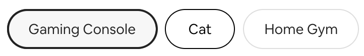
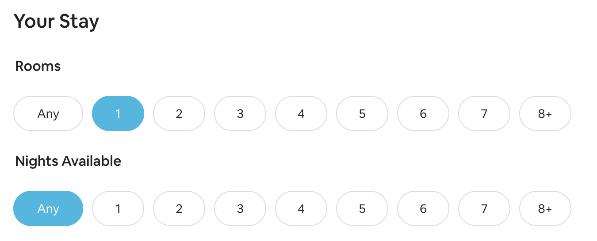

# Intro to Storybook

## Getaways UI Library

## Objectives

- Use Storybook as a way to test the functionality of individual components in isolation.
- Modify existing components based on errors identified in testing.
- Refactor specific Stories to allow for controls.
- Read, understand, and make adjustments to the stories configuration files.
- Write entirely new stories to test components.

## Why?

Storybook is a way to integrate some of the principles of test-driven development into front-end development. Coupled with TypeScript, building your components in Storybook can be a powerful way to narrow your focus onto a single component at a time, and significantly reduce the number of front-end errors you encounter later on.

Done well, Storybook can be hosted as documentation for anyone rolling onto a project to explain what components have been built and how they operate. Storybook will even attempt to auto-generate documentation, which can make bringing a new team member up to speed on a given project a lot quicker.

For example, car manufacturer Audi maintains a [Storybook](https://react.ui.audi/?path=/docs/introduction--page) for its web developers and designers, and you can see they've provided clear examples of certain UI Components and how they're meant to be used. Check out their [Buttons](https://react.ui.audi/?path=/docs/components-buttons-all-stories--primary-button) to see what that looks like in practice.

## Setup

Install the packages as usual with `npm i` or `npm install`.

Since this is a storybook lab, you can run `npm run start` if you like, but you'll find there isn't much in the App just yet. Since the goal is to focus on individual components in isolation, you'll need to run `npm run storybook` instead.

## Framing

You're building individual components that will be used as part of a large application called Getaways. Getaways aims to match travelers looking for an escape with hosts willing to rent out a room or a portion of their home for a short stay.

Since this project is just getting started, we're aiming to build out four main components:

- An ActionButton, which is just a stylized button to be used only for CTAs throughout the site. Another team is working on a more subtle button for less significant user interactions.
- A Badge, which is a small indicator of whether or not your booking has been initiated, accepted, rejected, or canceled.
- A Tile, which is a listing for a specific Getaway. The only complicated part of the Tile is that it needs to be capable of being laid out either horizontally or vertically.
- A Review, which is a smallish tile that bears the name, date, and review of a previous guest. These endorsements will help build trust.

## Exercises

0. Look at the stories as they are - play with as many as you like, and take time to notice what the Storybook will and will not do.

1. Notice that the ActionButton and Badge stories are working, but the Tile stories aren't. That's because storybook comes configured by default to look in the stories folder for relevant files, but doesn't check the subfolders of `components`. Open the `.storybook` directory and examine the config files. Find the array that indicates where stories are to be found, and add a new entry to that array which will help Storybook locate the stories files inside component folders.

2. Once that's done, go ahead and move ALL the stories to the folders of their specific components. It's definitely easier to use this way, and your team members have agreed on this as the norm.

3. Once you've loaded in the Tile stories, turn your attention back to badges. Your badge is supposed to render green for a successful booking, red for a failed one, yellow for a pending booking, and grey for a canceled or abandoned booking, but it's clear that at least some of these features aren't finished. Figure out what needs to be changed, and revise the Badge component accordingly.

4. Next, turn your attention to the buttons. Notice that the first two buttons have working controls, but the third button doesn't. Notice also that the first and second button are logging actions appropriately, but the third button is not. Follow the link in Storybook to the documentation about how to configure controls, and then rewrite the small button according to that documentation, referencing the other stories for examples about where to adjust or adapt to account for TypeScript.

5. Notice that our `ButtonProps` specify that the `onClick` prop is a function, and yet our stories don't include that `onClick` prop at all. However, the active buttons still register the event that would trigger the onClick function in the "Actions" tab in Storybook. Add a fourth story for an alert button, but this time _do_ include a function with an alert as the onClick prop. Notice that when there _is_ a function which can be run, the action is not logged in Storybook - the function is simply executed instead.

6. Add a fifth story for a small, inactive button. Before moving on to the next step, navigate to the "Docs" tab for the Action Button and notice that each argument has been briefly described.

7. Add a new story for the Tile component and confirm that it's working as expected. Then navigate to the "Docs" tab and notice that the Tile component lacks the level of documentation detail that our UI components had. Open the `Tile.tsx` and use JSDoc comments to annotate the component and the props interface with any additional details the user might find helpful.

8. The Review component doesn't have any stories whatsoever. Add at least one story to test out the user reviews. If you've got writer's block, feel free to use the following raw data:

```
name: Jesse Howard
date: October 2021
review: Mariano was an exceptionally welcoming host, and the neighborhood was just as charming as advertised. If you're coming from further north, be sure to bring sunscreen with you - the beach really is walking distance away.
profile pic: https://placeimg.com/400/400/people
```

## Extensions

Now that you've had time to practice building and testing components in Storybook, it's time to build you own based on the mockups your designer sent over.

9. The design team wants a `SearchToggle` that serves as a visual indicator of what the user needs. The example below shows what a SearchToggle should look like when it's selected, when it's being hovered, and the default styling - in the image, the user has determined they need a gaming console, and are considering a Cat-friendly listing (hovering over that toggle), but has not selected a Home Gym. Write stories to test both the selected and unselected states.



> Bear in mind that in addition to a text prop, the toggle will need to take a prop indicating whether or not it is currently selected, and an event handler function as a prop so that the parent component (presumably a component that handles searches) can be aware changes in the user's selections.

10. Now that we've added that UI Component for a SearchToggle, we're ready to build out one small piece of the search. The `YourStay` component is part of a larger search component, so all it needs to know is how many nights you're looking for, and how many bedrooms you need. You can see that this will use the `SearchToggle` component, but it appears to use them in a slightly different way - more like radio buttons and less like checkboxes (and the background color is a bit different!). You may decide to build out an entirely new UIComponent, but this is definitely achievable with small-scale modifications.


